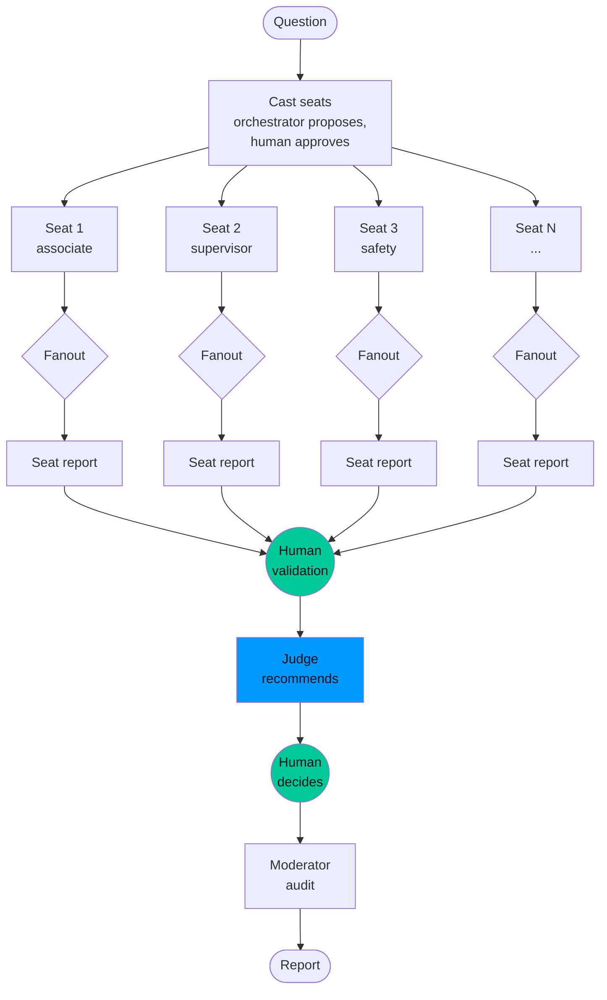
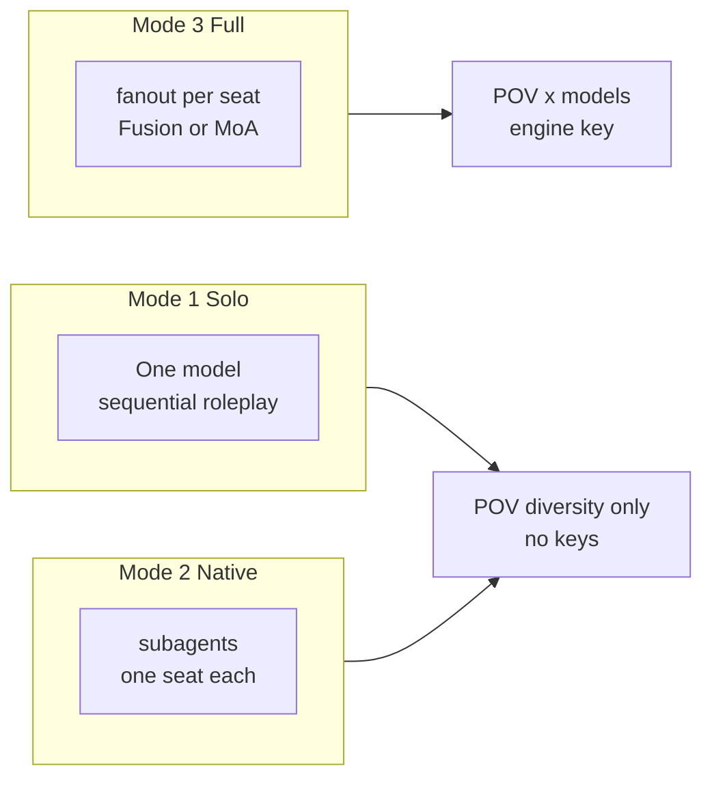

# Storm Panel Research

[](LICENSE)
[](https://hermes-agent.nousresearch.com/docs)
[](SPEC.md)

A human-gated perspective-panel adaptation of Stanford's STORM methodology. One question,
several seats, one judge, one human. No hardcoded models: the human picks the engine
every run.

Based on: Shao et al., NAACL 2024 -- "Assisting in Writing Wikipedia-like Articles from Scratch with Large Language Models"

## What is it?

STORM (Synthesis of Topic Outlines through Retrieval and Multi-perspective question asking)
is a research pipeline from Stanford's Oval Lab that mimics investigative journalism:
discover the viewpoints a topic deserves, interview each one, ground every claim in
retrievable sources, then synthesize.

This adaptation changes the question. Stanford asks how to write the article. This asks
how to make the call. A DC issue seats the associate, the supervisor, safety, and the
customer. Same question, four truths. The judge synthesizes, the human decides.

Two improvements on Stanford: the human gates four checkpoints (cast, validation, verdict,
audit), and mode 3 gives every seat its own multi-model fanout. Full design: `PANEL-SPEC.md`.

## Architecture



Green nodes are human gates. The judge recommends, the human decides, the moderator audits.

## The three modes



| Mode | Seats | Brains | Diversity | Keys |
|------|-------|--------|-----------|------|
| 1 Solo | 2-4 | One model, sequential | POV only | None |
| 2 Native panel | 2-12, parallel subagents | Human's model pick | POV only | None |
| 3 Full panel | 2-12, fanout per seat | OpenRouter Fusion or Hermes MoA | POV times models | Engine key |

The orchestrator sizes the panel to the problem: societal issue, up to a dozen seats;
broken deploy, two (design and engineering). The human approves or amends the cast.

## How it works

Cast -> interview -> human validation -> outline -> grounded writing -> moderator audit.
Unsourced claims are marked `unverified`. Thin sections say `needs more research`.
The judge recommends with weighted contradictions; the human makes the call.

## Install as a Hermes plugin

```bash
hermes plugins install storm-fusion-research
```

Or clone into your plugins directory. The skill loads namespaced as
`storm-fusion-research:storm-fusion-research`. Modes 1 and 2 need no keys. Mode 3 needs
one fanout engine (OpenRouter Fusion or a Hermes MoA preset) with a human-chosen lineup.

One-time consent for per-call model picks:

```yaml
plugins:
  entries:
    storm-fusion-research:
      llm:
        allow_provider_override: true
        allow_model_override: true
```

See `skills/storm-fusion-research/SKILL.md` for the full procedure.

## Example run

Two seats, active model, one tool call:

```json
{
  "topic": "Should a small DC add a second packing station before peak?",
  "seats": [
    {"name": "associate", "brief": "You pack boxes every shift.",
     "questions": ["Where does packing actually bottleneck?"]},
    {"name": "supervisor", "brief": "You own the shift plan and labor hours.",
     "questions": ["Does a second station pay back in one season?"]}
  ]
}
```

Result: associate flagged flow and layout, supervisor ran the capacity math, judge
recommended the station only with handoff fixes after validating peak demand. Seats
report, judge weighs, human decides.

## Results

Tested against RAG chatbots and STORM+QA across seven metrics (Co-STORM human evaluation, 20 participants):

| Metric | RAG Chatbot | STORM+QA | Co-STORM |
|--------|-------------|----------|----------|
| Report Relevance | 3.57 | 3.61 | **3.78** |
| Report Breadth | 3.50 | 3.61 | **3.79** |
| Report Depth | 3.26 | 3.43 | **3.77** |
| Report Novelty | 2.44 | 2.50 | **3.05** |
| Unique URLs | 2.94 | 2.89 | **6.04** |

Key finding: Removing the moderator hurts performance more than reducing the number of experts.

## Implementation Notes

- Reference implementation: [stanford-oval/storm](https://github.com/stanford-oval/storm) (31.5k stars)
- Mixture of Agents: [Hermes MoA docs](https://hermes-agent.nousresearch.com/docs/user-guide/features/mixture-of-agents)
- This repo: [bmtrnavsky/storm-fusion-research-pipeline](https://github.com/bmtrnavsky/storm-fusion-research-pipeline)

## License

MIT
